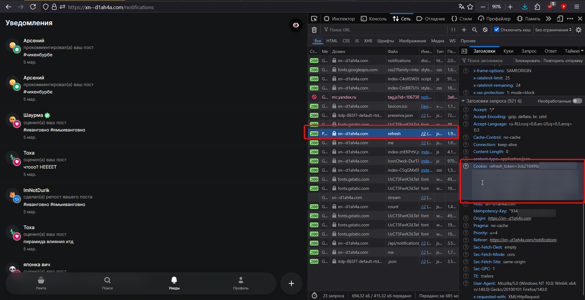
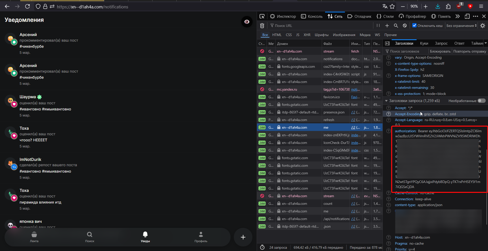

# itd-sdk

[](https://github.com/fi-res/ncruff)

SDK для работы с [https://xn--d1ah4a.com](итд.com) на python.

Документация: https://itdsdk.qzz.io/docs (wip)

## Установка

```bash
uv add itd-sdk
```

или через pip:

```bash
pip install itd-sdk
```

## Вход

Сейчас есть 3 способа авторизации в SDK:

1. Без авторизации. Доступен поиск и хэштэги.
2. Авторизация через `access_token`. Доступны все запросы кроме тех, которые связаны с авторизацией. Токен действует 15 минут.
3. Авторизация через `refresh_token`. Доступны все запросы. Токен действует 7 дней.

### Получение `refresh_token`

1. Откройте [итд.com](https://xn--d1ah4a.com) в браузере
2. Откройте DevTools (<kbd>F12</kbd>)
3. Перейдите на вкладку **"Network"** \ **"Сеть"**
4. Обновите страницу
5. Найдите запрос к `/v1/auth/refresh`
6. Скопируйте значение **refresh_token** из **Cookies** \ **Куки**



### Получение `access_token`

1. Откройте [итд.com](https://xn--d1ah4a.com) в браузере
2. Откройте DevTools (<kbd>F12</kbd>)
3. Перейдите на вкладку **"Network"** \ **"Сеть"**
4. Откройте любой запрос (если запросов нету, подождите 1-3сек - итд постоянно посылает запросы на обновление статистики постов)
5. Скопируйте значение **authozation** из **Request headers** \ **Заголовки запроса**



## API

```python
from itd import Me, User, Post, Posts, File, Hashtag, Notifications

me = Me() # получить себя
me.privacy.update(is_private=True)

user = User('itd_sdk') # получить пользователя
user.follow()

post = Post('725681ba-2aaa-42d8-87fb-490c0f44e162') # получить пост
post.like()
post.add_comment('тест комент 6 7')
Post('02bcbba4-f365-4b98-9291-d0bc1fb36fe4').poll.vote('тест') # голосования в опросах

posts = Posts() # получить посты из ленты
for i, post in enumerate(Posts()):
    post.like() # встроенные защиты, из-за которых рейт-лимит будет получить сложнее + авто ожидание окончания рейт лимита
    if i > 10:
        break

post = user.posts[5] # индексация, авто-получение до нужного значения
post.repost()

file = File.from_path('1.jpg') # загрузка файлов
Post.new('всем привет!', attachments=file) # attachments может быть списком, файлом, или UUID

hashtag = Hashtag('тестапи') # получить данные хэштэга
print(hashtag.posts_count)
hashtag.posts[0].like()

notifications = Notifications() # получить уведы
notifications[30].read()
notifications.read_all()
for notification in notifications.stream(): # SSE уведомлений
    print(notification.type.value)
    break

def on_like(notification):
    print('лайк от', notification.actor.username)
    notifications.stop_stream()
notifications.on_like = on_like
stream = notifications.stream_bg() # background SSE
```

Весь API - https://itdsdk.qzz.io/docs/

## Прочее

- Лицезия: [MIT](./LICENSE)
- Автор:
    - ИТД: [@itd_sdk](https://xn--d1ah4a.com/@itd_sdk) или [@fdg](https://xn--d1ah4a.com/@pingbot)
    - ТГ: [@desicars](https://t.me/desicars)

[](https://www.star-history.com/?repos=itd-sdk%2Fitd-sdk&type=date&legend=top-left)
